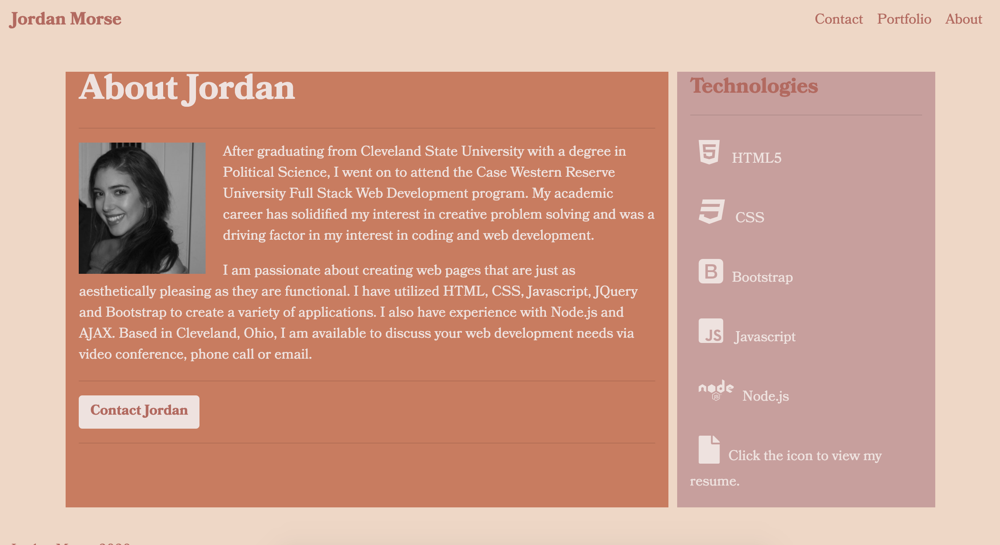

This assignment was to create a responsive personal portfolio webpage with a Contact, About and Portfolio page. I utilized HTML, CSS and Bootstrap components to create, style and ensure responsiveness to multiple screen types and sizes. The portfolio is an introduction with a small about page and links to my social media profiles as well as ways to contact me. The portfolio page includes three projects.

Site Link: https://jordanmorse.github.io/firstportfolio/
Github repository: https://github.com/jordanmorse/firstportfolio

 

